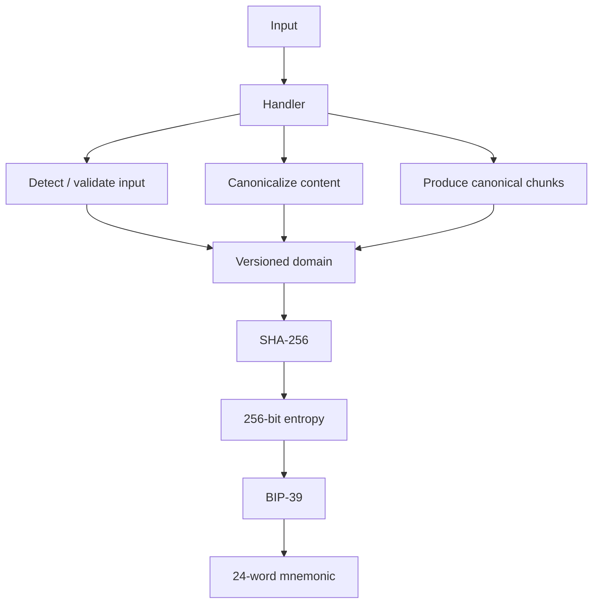

# Majik BIP-39

[](https://www.thezelijah.world) 

Deterministically derive a **standard BIP-39 mnemonic** from supported binary inputs such as images.

`@majikah/majik-bip-39` converts an input into a **versioned canonical representation**, derives exactly **256 bits of entropy**, and encodes that entropy using the standard BIP-39 wordlists.

The library does **not redefine BIP-39**. It only provides a deterministic way to produce BIP-39-compatible entropy from structured input.

> **Current support:** PNG images
> **Planned:** additional media handlers such as WAV/audio and video
>

   [](https://opensource.org/licenses/Apache-2.0)

---

## Table of Contents

- [Majik BIP-39](#majik-bip-39)
  - [Table of Contents](#table-of-contents)
  - [Features](#features)
  - [Installation](#installation)
  - [Quick Start](#quick-start)
    - [Derive from bytes](#derive-from-bytes)
    - [Derive from a browser `File`](#derive-from-a-browser-file)
  - [How It Works](#how-it-works)
    - [Passphrase mode](#passphrase-mode)
  - [Determinism](#determinism)
    - [Language does not change the entropy](#language-does-not-change-the-entropy)
- [Image Derivation](#image-derivation)
  - [PNG Canonicalization](#png-canonicalization)
    - [Supported image data](#supported-image-data)
    - [Currently rejected](#currently-rejected)
- [Resource Limits](#resource-limits)
- [Passphrase Mode](#passphrase-mode-1)
    - [Important](#important)
- [BIP-39 Helpers](#bip-39-helpers)
  - [Entropy → mnemonic](#entropy--mnemonic)
  - [Mnemonic → entropy](#mnemonic--entropy)
  - [Validate a mnemonic](#validate-a-mnemonic)
- [Supported BIP-39 Languages](#supported-bip-39-languages)
- [API](#api)
  - [`MajikBip39.fromBytes()`](#majikbip39frombytes)
  - [`MajikBip39.fromFile()`](#majikbip39fromfile)
  - [`MajikBip39.derive()`](#majikbip39derive)
  - [`MajikBip39.deriveMnemonic()`](#majikbip39derivemnemonic)
  - [`MajikBip39.deriveEntropy()`](#majikbip39deriveentropy)
  - [`MajikBip39.toMnemonic()`](#majikbip39tomnemonic)
  - [`MajikBip39.toEntropy()`](#majikbip39toentropy)
  - [`MajikBip39.validateMnemonic()`](#majikbip39validatemnemonic)
  - [`MajikBip39.listHandlers()`](#majikbip39listhandlers)
  - [`MajikBip39.listSchemes()`](#majikbip39listschemes)
- [Scheme Resolution](#scheme-resolution)
- [Errors](#errors)
- [Versioned Derivation](#versioned-derivation)
- [Reproducibility](#reproducibility)
- [Security Considerations](#security-considerations)
  - [This is deterministic derivation, not random generation](#this-is-deterministic-derivation-not-random-generation)
  - [Do not expose the mnemonic](#do-not-expose-the-mnemonic)
  - [Passphrase security](#passphrase-security)
  - [Input entropy is not automatically wallet entropy](#input-entropy-is-not-automatically-wallet-entropy)
- [Privacy](#privacy)
- [Design Philosophy](#design-philosophy)
- [Current Status](#current-status)
    - [Implemented](#implemented)
    - [Planned](#planned)
- [Example: Complete Deterministic Flow](#example-complete-deterministic-flow)
- [Compatibility with BIP-39](#compatibility-with-bip-39)
- [Important Limitations](#important-limitations)
  - [License](#license)
  - [Author](#author)
  - [Contact](#contact)


---

## Features

* Deterministic input → BIP-39 derivation
* Versioned, handler-specific canonicalization
* Metadata-independent PNG canonicalization
* Standard BIP-39 entropy and mnemonic encoding
* Optional Argon2id passphrase derivation
* Multiple BIP-39 languages
* Browser `Blob` / `File` support
* Node.js `Uint8Array` support
* Explicit resource limits for untrusted input
* Extensible handler architecture for future media types
* Strict scheme resolution; no silent format guessing when ambiguous
* Standard BIP-39 import/export helpers

---

## Installation

```sh
npm install @majikah/majik-bip-39
```

---

## Quick Start

### Derive from bytes

```js
import { readFile } from "node:fs/promises";
import { MajikBip39 } from "@majikah/majik-bip-39";

const image = new Uint8Array(
  await readFile("./image.png")
);

const mnemonic = await MajikBip39.fromBytes(image, {
  mediaType: "image/png",
});

console.log(mnemonic);
```

The resulting mnemonic is a normal **24-word BIP-39 mnemonic**.

---

### Derive from a browser `File`

`fromFile()` accepts any `Blob` or `File` that provides `arrayBuffer()`.

```js
const mnemonic = await MajikBip39.fromFile(file);

console.log(mnemonic);
```

You may also provide derivation options:

```js
const mnemonic = await MajikBip39.fromFile(file, {
  mediaType: "image/png",
  mnemonicLanguage: "en",
});
```

---

## How It Works

Majik BIP-39 uses a two-stage model:



For an input without a passphrase, the core derivation is conceptually:

```text
digest =
  SHA-256(
    UTF-8(canonical-domain) ||
    canonical-chunk-1 ||
    canonical-chunk-2 ||
    ...
  )
```

The resulting 32-byte digest is used directly as BIP-39 entropy.

### Passphrase mode

When a passphrase is supplied, Majik BIP-39 derives the final entropy using Argon2id.

Conceptually:

```text
digest =
  SHA-256(
    UTF-8(canonical-domain) ||
    canonical-content
  )

salt =
  SHA-256(
    UTF-8(canonical-domain + "/salt") ||
    digest
  )

entropy =
  Argon2id(
    passphrase,
    salt,
    versioned parameters
  )
```

The final result is still ordinary **32-byte BIP-39 entropy**.

This means the output remains compatible with software that understands standard BIP-39.

---

## Determinism

For a fixed scheme, canonical representation, passphrase, and BIP-39 wordlist, the same input produces the same mnemonic.

For example:

```text
same image
    +
same scheme
    +
same passphrase
    +
same canonicalization version
    =
same entropy
    =
same mnemonic
```

Without a passphrase, the result depends only on the canonicalized content.

With a passphrase, the passphrase becomes part of the derivation.

### Language does not change the entropy

Changing the BIP-39 language changes the **words used to represent the entropy**, not the underlying entropy itself.

For example, these are different textual representations of the same 256-bit value:

```js
const entropy = await MajikBip39.deriveEntropy(image, {
  mediaType: "image/png",
});

const english = await MajikBip39.toMnemonic(entropy, "en");
const japanese = await MajikBip39.toMnemonic(entropy, "ja");
```

The entropy is identical; only the BIP-39 wordlist changes.

---

# Image Derivation

The currently implemented handler is the PNG image handler.

The default scheme is:

```text
image-v1
```

You can explicitly request it:

```js
const mnemonic = await MajikBip39.fromBytes(image, {
  mediaType: "image/png",
  scheme: "image-v1",
});
```

Or inspect the complete derivation result:

```js
const result = await MajikBip39.derive(image, {
  mediaType: "image/png",
  scheme: "image-v1",
});

console.log(result.mnemonic);
console.log(result.entropy);
console.log(result.scheme);
console.log(result.handler);
console.log(result.passphraseUsed);
console.log(result.canonicalization);
```

A result has the following shape:

```ts
interface Bip39DerivationResult {
  mnemonic: string;
  entropy: Uint8Array;
  scheme: Scheme;
  handler: HandlerId;
  passphraseUsed: boolean;
  canonicalization: unknown;
}
```

The exact `canonicalization` metadata is handler-specific.

---

## PNG Canonicalization

`image-v1` does not hash the raw PNG file bytes directly.

Instead, the image handler decodes the PNG and constructs a canonical representation of its pixel data.

This is important because a PNG file can contain metadata or encoding differences while representing the same underlying image.

Consequently, image metadata and other non-canonical PNG information do not affect the derived mnemonic.

Conceptually:

```text
PNG file
   │
   ├─ metadata
   ├─ ancillary chunks
   ├─ encoding details
   └─ pixel data
          │
          ▼
   canonical pixels
          │
          ▼
      image-v1
          │
          ▼
       SHA-256
```

Two PNG files that canonicalize to the same representation produce the same result.

### Supported image data

`image-v1` currently supports static, non-indexed PNG images using:

* 8-bit grayscale
* 16-bit grayscale
* 8-bit grayscale + alpha
* 16-bit grayscale + alpha
* 8-bit RGB
* 16-bit RGB
* 8-bit RGBA
* 16-bit RGBA

### Currently rejected

The current handler rejects:

* animated PNGs
* indexed / palette-based PNGs
* `tRNS` transparency
* bit depths below 8 bits

Other image formats may be recognized at the input-detection layer, but their decoders are not yet implemented.

In particular, JPEG, BMP, WebP, and TIFF decoding are currently unavailable.

---

# Resource Limits

Image processing operates on untrusted binary input, so the library applies explicit resource limits.

The default limits are:

| Limit                |    Default |
| -------------------- | ---------: |
| Maximum file size    |     64 MiB |
| Maximum width        |  16,384 px |
| Maximum height       |  16,384 px |
| Maximum total pixels | 64,000,000 |

These limits can be overridden:

```js
const mnemonic = await MajikBip39.fromBytes(image, {
  mediaType: "image/png",
  limits: {
    maxFileBytes: 32 * 1024 * 1024,
    maxWidth: 8192,
    maxHeight: 8192,
    maxPixels: 32_000_000,
  },
});
```

Use lower limits when processing untrusted files in memory-constrained environments.

Limits must be positive integers.

---

# Passphrase Mode

An optional passphrase adds a password-based derivation step using **Argon2id**.

```js
const mnemonic = await MajikBip39.fromBytes(image, {
  mediaType: "image/png",
  passphrase: "your private passphrase",
});
```

A different passphrase produces a different entropy value and therefore a different mnemonic.

The passphrase is normalized before derivation.

```text
same image + different passphrase
        │
        ▼
    different entropy
        │
        ▼
    different mnemonic
```

### Important

A passphrase is not automatically a secure password.

A weak, predictable, reused, or exposed passphrase remains weak.

Do not treat passphrase mode as protection against a low-entropy or publicly known input.

---

# BIP-39 Helpers

Majik BIP-39 also exposes standard BIP-39 conversion and validation helpers.

These functions are independent of image derivation.

## Entropy → mnemonic

```js
const mnemonic = await MajikBip39.toMnemonic(
  entropy,
  "en",
);
```

The standard BIP-39 entropy sizes are supported:

```text
16 bytes  → 12 words
20 bytes  → 15 words
24 bytes  → 18 words
28 bytes  → 21 words
32 bytes  → 24 words
```

Invalid entropy lengths are rejected.

---

## Mnemonic → entropy

```js
const entropy = await MajikBip39.toEntropy(
  mnemonic,
  "en",
);
```

The mnemonic is validated against the selected BIP-39 wordlist before entropy is returned.

---

## Validate a mnemonic

```js
const result = await MajikBip39.validateMnemonic(
  mnemonic,
  "en",
);

console.log(result.valid);
console.log(result.wordCount);
```

Example result:

```js
{
  valid: true,
  wordCount: 24
}
```

An invalid mnemonic returns `valid: false`.

An unsupported language is rejected.

---

# Supported BIP-39 Languages

The following standard wordlists are currently supported:

| Language            | Code    |
| ------------------- | ------- |
| English             | `en`    |
| French              | `fr`    |
| Spanish             | `es`    |
| Italian             | `it`    |
| Japanese            | `ja`    |
| Korean              | `ko`    |
| Czech               | `czech` |
| Portuguese          | `pt`    |
| Simplified Chinese  | `zh-cn` |
| Traditional Chinese | `zh-tw` |

Example:

```js
const mnemonic = await MajikBip39.fromBytes(image, {
  mediaType: "image/png",
  mnemonicLanguage: "ja",
});
```

---

# API

## `MajikBip39.fromBytes()`

Derive a mnemonic from raw bytes.

```ts
static async fromBytes(
  bytes: Uint8Array,
  options?: DeriveOptions,
): Promise<string>
```

This is the simplest entry point for Node.js and other byte-oriented environments.

---

## `MajikBip39.fromFile()`

Derive a mnemonic from a browser `File` or `Blob`.

```ts
static async fromFile(
  file: Blob,
  options?: DeriveOptions,
): Promise<string>
```

The file contents are read into a `Uint8Array` before processing.

The file's MIME type is used as `mediaType` when available.

An explicitly supplied `mediaType` in `options` takes precedence over the automatic file MIME type.

---

## `MajikBip39.derive()`

Return the complete derivation result.

```ts
static async derive(
  bytes: Uint8Array,
  options?: DeriveOptions,
): Promise<Bip39DerivationResult>
```

Use this when an application needs the entropy, scheme, handler, or canonicalization information in addition to the mnemonic.

---

## `MajikBip39.deriveMnemonic()`

Alias for mnemonic derivation:

```ts
static async deriveMnemonic(
  bytes: Uint8Array,
  options?: DeriveOptions,
): Promise<string>
```

---

## `MajikBip39.deriveEntropy()`

Derive only the final BIP-39 entropy.

```ts
static async deriveEntropy(
  bytes: Uint8Array,
  options?: DeriveOptions,
): Promise<Uint8Array>
```

The current image derivation produces 32 bytes / 256 bits of entropy.

---

## `MajikBip39.toMnemonic()`

Convert valid BIP-39 entropy to a mnemonic.

```ts
static async toMnemonic(
  entropy: Uint8Array,
  language?: MnemonicLanguage,
): Promise<string>
```

---

## `MajikBip39.toEntropy()`

Convert and validate a BIP-39 mnemonic.

```ts
static async toEntropy(
  mnemonic: string,
  language?: MnemonicLanguage,
): Promise<Uint8Array>
```

---

## `MajikBip39.validateMnemonic()`

Validate a mnemonic against the selected wordlist.

```ts
static async validateMnemonic(
  mnemonic: string,
  language?: MnemonicLanguage,
): Promise<MnemonicValidation>
```

---

## `MajikBip39.listHandlers()`

List registered input handlers.

```js
const handlers = MajikBip39.listHandlers();

console.log(handlers);
```

This is useful for feature discovery in applications.

---

## `MajikBip39.listSchemes()`

List schemes currently exposed by the registered handlers.

```js
const schemes = MajikBip39.listSchemes();

console.log(schemes);
```

As additional handlers are added, this registry becomes the discovery mechanism for supported derivation schemes.

---

# Scheme Resolution

Majik BIP-39 intentionally does not silently guess between multiple possible derivation schemes.

Resolution follows this order:

```text
1. Explicit scheme
      ↓
2. Declared media type
      ↓
3. Content detection
```

For example:

```js
const result = await MajikBip39.derive(image, {
  mediaType: "image/png",
  scheme: "image-v1",
});
```

When no scheme is explicitly specified, the library attempts to determine the appropriate handler.

If no handler recognizes the input, derivation fails.

If multiple handlers recognize the input and no scheme was specified, derivation fails with an ambiguity error rather than selecting one arbitrarily.

This makes derivation behavior explicit and reproducible.

---

# Errors

The library exposes specific error types for common failure conditions, including:

* `HandlerNotFoundError`
* `InvalidEntropyLengthError`
* `InvalidInputError`
* `InvalidMnemonicError`
* `InvalidOptionError`
* `UnsupportedSchemeError`

Example:

```js
import {
  HandlerNotFoundError,
  UnsupportedSchemeError,
} from "@majikah/majik-bip-39";

try {
  const mnemonic = await MajikBip39.fromBytes(input);
} catch (error) {
  if (error instanceof HandlerNotFoundError) {
    console.error("Unsupported input");
  } else if (error instanceof UnsupportedSchemeError) {
    console.error("Unsupported derivation scheme");
  } else {
    throw error;
  }
}
```

---

# Versioned Derivation

Derivation schemes are explicitly versioned.

For example:

```text
image-v1
```

should be treated as a stable algorithm identifier rather than merely an implementation label.

Applications that need long-term reproducibility should persist the scheme alongside any other recovery information.

A future `image-v2` may use different canonicalization or derivation rules without changing the meaning of `image-v1`.

This separation allows the library to evolve without silently changing existing derivation results.

---

# Reproducibility

For deterministic recovery, preserve enough information to reproduce the original derivation:

```text
Input
Scheme
Passphrase
Canonicalization version
```

The mnemonic language only affects the textual BIP-39 representation; the underlying entropy remains the same.

For long-term interoperability, storing the explicit scheme is recommended instead of relying on the current default.

---

# Security Considerations

## This is deterministic derivation, not random generation

A mnemonic derived from an image inherits its unpredictability from the image and any passphrase used.

A predictable or publicly available image can produce a predictable mnemonic.

For example, using a famous photograph, stock image, logo, or otherwise publicly known file should not be assumed to provide secret entropy.

```text
public / guessable input
        +
predictable derivation
        =
guessable secret
```

This is fundamentally different from generating a wallet mnemonic from a cryptographically secure random number generator.

---

## Do not expose the mnemonic

The resulting mnemonic and entropy are sensitive secrets.

Avoid:

* logging them
* sending them to analytics systems
* storing them in URLs
* embedding them in source code
* putting them in telemetry
* displaying them unnecessarily
* publishing the source image when the image itself is intended to be secret

Applications should handle derived entropy and mnemonics with the same care as other wallet secrets.

---

## Passphrase security

Argon2id increases the cost of passphrase guessing, but it cannot compensate for a weak or exposed passphrase.

Use a strong, unique passphrase when passphrase mode is part of the security model.

---

## Input entropy is not automatically wallet entropy

A deterministic image-to-mnemonic system can be useful for reproducibility, portability, experimentation, or specialized recovery workflows.

It should **not automatically be considered a replacement for cryptographically secure random wallet generation**.

Before using image-derived mnemonics for high-value assets, independently evaluate:

* input entropy
* attacker knowledge of the input
* passphrase strength
* recovery procedures
* canonicalization stability
* scheme/version persistence
* operational security

---

# Privacy

Majik BIP-39 performs derivation locally from the supplied bytes.

The library itself does not require a remote service, account, or network-based derivation step.

Applications are still responsible for avoiding accidental disclosure through their own logging, storage, telemetry, synchronization, or UI layers.

---

# Design Philosophy

Majik BIP-39 is intentionally split into two concerns:

```text
Input-specific processing
        │
        ▼
Canonical representation
        │
        ▼
Deterministic entropy
        │
        ▼
Standard BIP-39
```

The media handler is responsible for understanding a specific input type.

BIP-39 remains responsible for mnemonic encoding.

This separation makes it possible to add new handlers without creating a new mnemonic standard for every media type.

Future handlers may support inputs such as:

```text
PNG
WAV
MP3
FLAC
MP4
...
```

while still producing ordinary BIP-39 entropy and mnemonics.

---

# Current Status

### Implemented

* PNG image handler
* `image-v1`
* deterministic canonicalization
* SHA-256 derivation
* optional Argon2id passphrase mode
* 256-bit entropy output
* BIP-39 mnemonic encoding
* BIP-39 mnemonic validation
* BIP-39 entropy ↔ mnemonic conversion
* 10 BIP-39 wordlists
* browser `Blob` / `File` input
* byte-oriented input
* image resource limits
* handler and scheme registry

### Planned

Additional input handlers are intended to be added without changing the BIP-39 layer.

Examples include:

* WAV / PCM audio
* other audio formats
* video
* additional deterministic media representations

Each handler should define its own canonicalization and versioned scheme while preserving standard BIP-39 compatibility.

---

# Example: Complete Deterministic Flow

```js
import { readFile } from "node:fs/promises";
import { MajikBip39 } from "@majikah/majik-bip-39";

const image = new Uint8Array(
  await readFile("./secret.png")
);

const result = await MajikBip39.derive(image, {
  mediaType: "image/png",
  scheme: "image-v1",
  passphrase: "correct horse battery staple",
  mnemonicLanguage: "en",
});

console.log("Mnemonic:", result.mnemonic);
console.log("Entropy:", result.entropy);
console.log("Scheme:", result.scheme);
console.log("Handler:", result.handler);
console.log("Passphrase used:", result.passphraseUsed);
console.log("Canonicalization:", result.canonicalization);
```

The same canonical input, scheme, passphrase, and derivation parameters will reproduce the same underlying entropy.

---

# Compatibility with BIP-39

The final output is a standard BIP-39 mnemonic.

That means applications can use the resulting mnemonic with existing BIP-39-compatible tooling, subject to the normal requirements of that application.

Majik BIP-39 does **not** introduce a custom mnemonic format.

Its purpose is to answer a different question:

> **How can deterministic input be converted into valid BIP-39 entropy?**

---

# Important Limitations

This library currently should not be interpreted as:

* a general-purpose image hash
* a cryptographically random number generator
* a replacement for secure wallet generation
* a custom BIP-39 implementation
* a universal media decoder

Only supported handlers and explicitly supported schemes should be relied upon.

The current implementation supports PNG images through `image-v1`; additional image formats and media types are not yet fully implemented.

---


## License

**License:** [Apache-2.0](LICENSE) — free for personal and commercial use.

## Author

Developed by **Josef Elijah Fabian (Zelijah)** | [Majikah Solutions OPC](https://majikah.solutions/about)

**Developer**: [Josef Elijah Fabian](https://github.com/jedlsf)

**GitHub**: [https://github.com/Majikah](https://github.com/Majikah)

**Project Repository**: [https://github.com/Majikah/majik-bip-39](https://github.com/Majikah/majik-bip-39)


---

## Contact

- **Business Email**: [business@majikah.solutions](mailto:business@majikah.solutions)
- **Official Website**: [https://www.thezelijah.world](https://www.thezelijah.world)
- **Majikah Ecosystem**: [https://majikah.solutions](https://majikah.solutions)