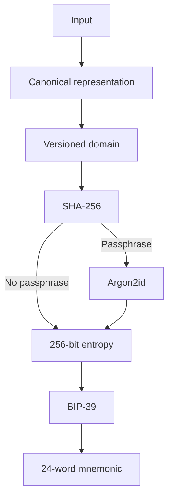

# Security Policy

This document describes the security model of `@majikah/majik-bip-39`, what the library does and does not guarantee, the risks of deterministic media-derived mnemonics, and how to report security vulnerabilities.

Majik BIP-39 is fundamentally a **deterministic secret-derivation library**. It can transform supported input into valid BIP-39 entropy and then into a standard BIP-39 mnemonic.

That property is useful for reproducibility and specialized recovery workflows, but it creates an important security consequence:

> **The input used to derive a mnemonic can itself become recovery material.**

For the current image handler, this means that an image used to derive a mnemonic must be treated as sensitive whenever the resulting mnemonic is sensitive.

If a generated mnemonic is used for a wallet, account, identity, encryption key, signing key, or any other production secret, **do not share the mnemonic and do not share the source image**.

If the derivation uses no passphrase, possession of the relevant canonical image content may be sufficient to reproduce the mnemonic.

---

## Table of Contents

- [Security Policy](#security-policy)
  - [Table of Contents](#table-of-contents)
  - [Reporting a Vulnerability](#reporting-a-vulnerability)
- [Security Model](#security-model)
  - [What this library actually does](#what-this-library-actually-does)
  - [Deterministic derivation](#deterministic-derivation)
  - [The source image is security-sensitive](#the-source-image-is-security-sensitive)
    - [Critical rule](#critical-rule)
    - [Do not share the image](#do-not-share-the-image)
    - [Do not share the mnemonic](#do-not-share-the-mnemonic)
  - [Canonicalization and reproducibility](#canonicalization-and-reproducibility)
    - [Important implication](#important-implication)
  - [Passphrase derivation](#passphrase-derivation)
    - [The passphrase must also be protected](#the-passphrase-must-also-be-protected)
    - [A weak passphrase remains weak](#a-weak-passphrase-remains-weak)
  - [Important: this is not the BIP-39 passphrase feature](#important-this-is-not-the-bip-39-passphrase-feature)
  - [BIP-39 compatibility](#bip-39-compatibility)
  - [Versioned schemes](#versioned-schemes)
  - [Handler and scheme resolution](#handler-and-scheme-resolution)
  - [Resource limits and hostile input](#resource-limits-and-hostile-input)
- [Critical Security Warning](#critical-security-warning)
  - [Never treat a generated mnemonic as disposable](#never-treat-a-generated-mnemonic-as-disposable)
  - [Never share the source image](#never-share-the-source-image)
  - [Never use a public image for a secret without understanding the consequences](#never-use-a-public-image-for-a-secret-without-understanding-the-consequences)
- [Scope](#scope)
  - [In scope](#in-scope)
  - [Out of scope](#out-of-scope)
- [Known Limitations \& Non-Goals](#known-limitations--non-goals)
    - [Deterministic derivation is not random generation](#deterministic-derivation-is-not-random-generation)
    - [The source input can become a recovery secret](#the-source-input-can-become-a-recovery-secret)
    - [The mnemonic is itself a root secret](#the-mnemonic-is-itself-a-root-secret)
    - [No guaranteed JavaScript memory erasure](#no-guaranteed-javascript-memory-erasure)
    - [No protection against a compromised host](#no-protection-against-a-compromised-host)
    - [Canonicalization defines equality](#canonicalization-defines-equality)
    - [BIP-39 does not authenticate the source image](#bip-39-does-not-authenticate-the-source-image)
    - [No wallet-security guarantee](#no-wallet-security-guarantee)
    - [No independent security audit unless explicitly stated for the release](#no-independent-security-audit-unless-explicitly-stated-for-the-release)
    - [Pre-1.0 API stability](#pre-10-api-stability)
- [Dependency \& Supply Chain](#dependency--supply-chain)
- [Secure Usage Guidelines](#secure-usage-guidelines)
  - [Strong recommendations](#strong-recommendations)
  - [Never do this](#never-do-this)
- [Production and Wallet Use](#production-and-wallet-use)
    - [Particularly important](#particularly-important)
- [Cryptographic Details](#cryptographic-details)
- [Disclosure Policy](#disclosure-policy)
- [Contact](#contact)
  - [Final Security Reminder](#final-security-reminder)

---

## Reporting a Vulnerability

**Please do not open a public GitHub issue for security vulnerabilities.**

Report privately via:

**Email** — [business@majikah.solutions](mailto:business@majikah.solutions), preferably with `SECURITY` in the subject line.

Please include:

* A description of the vulnerability and its potential impact
* Steps to reproduce the issue, or a minimal proof of concept
* The affected version(s)
* Whether the issue affects input canonicalization, derivation, passphrase handling, BIP-39 conversion, scheme resolution, image parsing, resource limits, or another component
* Whether the issue is in this package or an upstream dependency
* Relevant runtime information such as browser, Node.js, operating system, and package-manager version
* Any information that demonstrates incorrect entropy generation, mnemonic disclosure, derivation collisions, validation bypasses, or security-boundary bypasses

**Do not send real production mnemonics, production source images, wallet backups, private keys, or other live secrets when reporting a vulnerability.**

Use a synthetic test vector or a safely generated reproduction whenever possible.

This is an independently maintained project. Response times are best-effort and are not a contractual SLA.

We do not currently operate a paid bug bounty program.

---

# Security Model

## What this library actually does

Majik BIP-39 is a **deterministic input-to-entropy derivation library**.

For supported inputs, the library:

1. Detects or selects an input handler
2. Canonicalizes the input
3. Constructs a versioned domain-separated representation
4. Hashes that representation with SHA-256
5. Optionally applies Argon2id using a user-supplied passphrase
6. Produces BIP-39-compatible entropy
7. Encodes that entropy as a standard BIP-39 mnemonic

For the current `image-v1` implementation, successful derivation produces **32 bytes / 256 bits of entropy**, which becomes a **24-word BIP-39 mnemonic**.

The resulting mnemonic is not a custom Majik mnemonic format. It is an ordinary BIP-39 mnemonic.

Majik BIP-39 therefore provides:

* Deterministic derivation from supported input
* Versioned derivation schemes
* Canonicalized image processing
* Domain-separated hashing
* Optional Argon2id-based passphrase derivation
* Standard BIP-39 mnemonic encoding
* Standard BIP-39 mnemonic validation and entropy conversion
* Resource limits for image processing
* Extensible input handlers

It does **not** provide:

* Random secret generation
* Automatic entropy amplification from predictable files
* Protection against disclosure of the source input
* Protection against a compromised host or runtime
* Secure storage of the resulting mnemonic
* Secure storage of the source image
* A centralized recovery service
* A guarantee that JavaScript memory copies of secrets can be completely destroyed
* A guarantee that a public or predictable image results in a secure mnemonic

---

## Deterministic derivation

Majik BIP-39 is deterministic by design.

For a fixed:

* input
* canonical representation
* derivation scheme
* passphrase, if used
* implementation version represented by that scheme
* mnemonic wordlist

the same underlying entropy is reproduced.

Conceptually:



This reproducibility is both the primary feature and the primary security consideration.

An attacker who can reproduce the same derivation inputs can reproduce the same secret.

---

## The source image is security-sensitive

### Critical rule

**Treat the source image used to generate a production mnemonic as sensitive secret material.**

Do not assume that an image is harmless simply because it is an ordinary image file.

When an image is used as deterministic key material, the security relationship becomes:

```text
image
  +
derivation parameters
  =
mnemonic
  =
potential root secret
```

Therefore, if the resulting mnemonic controls anything valuable, the corresponding source image should be protected as carefully as the mnemonic itself.

### Do not share the image

Do not publish, upload, or distribute a production source image through:

* Social media
* Public repositories
* Public issue trackers
* Forums
* Websites
* Cloud storage with unintended sharing
* Messaging platforms
* Analytics pipelines
* Third-party processing services
* AI/image-processing services
* Untrusted applications
* Browser extensions
* Screenshots or recordings
* Debug logs or crash reports

Do not send the source image to another person merely because they ask to verify or reproduce the mnemonic.

Do not upload a production source image to a third-party website simply to "check" the result.

### Do not share the mnemonic

A mnemonic generated for production use must be treated as a secret.

Never:

* Post it publicly
* Send it through ordinary chat
* Put it in source code
* Commit it to Git
* Put it in an issue or pull request
* Log it
* Send it to analytics
* Put it in a URL
* Store it in plaintext cloud notes
* Paste it into untrusted software
* Give it to support personnel unless the security model explicitly requires it
* Use it as a test value in public documentation

Anyone who obtains a mnemonic may be able to reproduce whatever cryptographic identity or wallet is controlled by that mnemonic.

---

## Canonicalization and reproducibility

The image handler does not derive the mnemonic directly from arbitrary PNG file bytes.

Instead, `image-v1` canonicalizes supported image content before derivation.

This matters because two different files can represent the same canonical pixel content.

Consequently, the following may not provide meaningful security separation:

```text
Original PNG
     │
     ├── metadata removed
     ├── metadata changed
     ├── compatible PNG re-encoded
     └── ancillary metadata modified
            │
            ▼
     same canonical content
            │
            ▼
       same derivation
```

For `image-v1`, supported metadata and encoding differences that are excluded from canonicalization should not be relied upon as secret material.

### Important implication

Do not attempt to protect a secret mnemonic by saying:

> "The image is safe because I removed the metadata."

Metadata that is excluded from canonicalization is not part of the secret derivation.

Likewise, do not assume that changing an ignored PNG property creates a new secret.

---

## Passphrase derivation

Majik BIP-39 supports an optional passphrase.

When no passphrase is supplied, the canonicalized digest is used directly as the resulting 256-bit entropy.

When a passphrase is supplied, the library derives a domain-separated salt from the canonical derivation domain and digest, then derives the final entropy using Argon2id.

Conceptually:

```text
digest =
  SHA-256(
    domain ||
    canonical content
  )

salt =
  SHA-256(
    domain + "/salt" ||
    digest
  )

entropy =
  Argon2id(
    passphrase,
    salt,
    versioned parameters
  )
```

The Argon2id configuration is versioned through the library's derivation constants so the derivation scheme remains reproducible.

### The passphrase must also be protected

A passphrase does not make the source image public.

For a production secret derived with passphrase mode, protect **both**:

```text
source image
+
passphrase
```

Do not treat either one as public recovery information.

### A weak passphrase remains weak

Argon2id increases the computational cost of guessing, but it cannot create strong entropy from a weak human-chosen password.

Avoid:

* Short passphrases
* Common phrases
* Reused passwords
* Public information
* Names
* Dates
* Company names
* Project names
* Easily guessable patterns

Use a high-entropy, unique passphrase when passphrase mode is part of the security design.

---

## Important: this is not the BIP-39 passphrase feature

The `passphrase` option in Majik BIP-39 is a **pre-mnemonic derivation input**.

It is used to derive the final 256-bit entropy before the mnemonic is created.

This is distinct from the optional passphrase supported by wallets during the standard BIP-39 seed-generation process.

Conceptually:

```text
Majik BIP-39 passphrase
        │
        ▼
derivation
        │
        ▼
BIP-39 mnemonic
        │
        ▼
optional wallet-specific BIP-39 passphrase
        │
        ▼
BIP-39 seed
```

Applications must not assume these two mechanisms are interchangeable.

---

## BIP-39 compatibility

Majik BIP-39 uses standard BIP-39 encoding and wordlists.

For the current image derivation:

```text
256-bit entropy
        │
        ▼
24-word BIP-39 mnemonic
```

The resulting mnemonic can therefore be processed by standard BIP-39-compatible software, subject to the requirements of that software.

This interoperability does not make the derivation process itself standard BIP-39.

The library's media-to-entropy procedure is specific to Majik BIP-39.

BIP-39 begins at the entropy-to-mnemonic stage.

---

## Versioned schemes

Derivation schemes are explicitly versioned.

The current image scheme is:

```text
image-v1
```

A scheme identifier should be treated as part of the security and recovery metadata.

Future versions may change:

* Canonicalization
* Input validation
* Domain separation
* Hashing
* KDF parameters
* Output derivation rules
* Supported input characteristics

A future `image-v2` must not be assumed to reproduce `image-v1`.

For long-term recovery, applications should record the exact scheme used.

Do not assume the current default will remain the appropriate or only scheme forever.

---

## Handler and scheme resolution

The library intentionally avoids silently choosing between ambiguous handlers.

Resolution is:

```text
1. Explicit scheme
        ↓
2. Declared media type
        ↓
3. Content detection
```

If multiple handlers can process the same input and no explicit scheme resolves the ambiguity, derivation fails.

This is intentional.

Security-sensitive deterministic derivation should fail closed rather than silently selecting an unexpected interpretation of the input.

When reproducibility matters, applications should explicitly persist and specify the intended scheme.

---

## Resource limits and hostile input

Image processing can consume substantial memory and CPU resources.

An attacker may attempt to supply:

* Extremely large files
* Extremely large image dimensions
* Excessive pixel counts
* Malformed PNG structures
* Inputs designed to trigger expensive parsing or allocation

The image handler therefore applies configurable resource limits.

Current defaults include:

| Limit                |    Default |
| -------------------- | ---------: |
| Maximum file size    |     64 MiB |
| Maximum width        |  16,384 px |
| Maximum height       |  16,384 px |
| Maximum total pixels | 64,000,000 |

Applications processing untrusted input should consider lowering these limits according to their environment.

Resource limits are primarily a **availability control**. They should not be interpreted as a confidentiality mechanism.

---

# Critical Security Warning

## Never treat a generated mnemonic as disposable

If the derived mnemonic is used for anything important, assume that disclosure is equivalent to compromise.

This includes:

* Cryptocurrency wallets
* Root identities
* Signing identities
* Encryption identities
* Authentication secrets
* Deterministic key registries
* Production credentials
* Recovery credentials
* High-value accounts
* Long-term identity systems

Once a production mnemonic has been exposed, replacing or deleting the mnemonic from one location does not undo the exposure.

The attacker may already have copied it.

---

## Never share the source image

For the same reason:

> **The source image used to derive a production secret must be treated as a recovery secret.**

Do not publish it simply because the image itself is not obviously secret.

Do not assume that changing the filename, metadata, dimensions, or presentation makes the underlying derivation safe.

For `image-v1`, what matters is the canonicalized representation.

---

## Never use a public image for a secret without understanding the consequences

An image downloaded from the internet, taken from a public website, included in a public repository, or otherwise known to an attacker should be considered potentially guessable.

For example:

```text
public photograph
        +
known scheme
        +
no passphrase
        =
reproducible mnemonic
```

This may make the resulting secret unsuitable for security-sensitive use.

Even a visually unique image is not automatically cryptographically unpredictable.

---

# Scope

## In scope

Security issues involving:

* Deterministic entropy derivation
* Image canonicalization
* `image-v1`
* SHA-256 derivation
* Argon2id passphrase derivation
* Derivation-domain separation
* BIP-39 entropy generation
* BIP-39 mnemonic conversion
* BIP-39 mnemonic validation
* Wordlist handling
* Handler registration and resolution
* Scheme resolution
* Incorrect reproducibility
* Unexpected derivation collisions caused by implementation errors
* Canonicalization bugs that change or expose security properties
* Passphrase handling
* Secret disclosure caused by library behavior
* Resource-exhaustion vulnerabilities in supported input processing
* Malformed input handling
* Security-relevant serialization or API behavior
* Vulnerabilities that allow an attacker to obtain or predict a derived secret without the intended inputs
* Vulnerabilities that cause the library to silently derive a different secret than the documented scheme

## Out of scope

The following are generally outside the package's direct security boundary:

* User intentionally publishing their own mnemonic
* User intentionally publishing their own source image
* Weak or publicly known input chosen by the application
* Weak user-selected passphrases where no derivation bypass exists
* Loss of the mnemonic or source input
* Compromise of a machine already controlled by an attacker
* Malicious browser extensions with unrestricted access to application data
* Root-level or administrator-level operating-system compromise
* Runtime debugging or memory inspection by an attacker who already controls the process
* Social engineering
* Compromise entirely contained within an upstream dependency
* Security failures caused solely by unsafe application integration
* Wallet or downstream application vulnerabilities unrelated to Majik BIP-39

Upstream issues may still be worth reporting because they can affect applications using this package.

---

# Known Limitations & Non-Goals

The following limitations are intentional and should be considered when designing a security-sensitive application.

### Deterministic derivation is not random generation

Majik BIP-39 does not manufacture entropy from an input that does not already contain unpredictable information.

A predictable image remains predictable.

A publicly known image remains publicly known.

A low-entropy passphrase remains low entropy.

---

### The source input can become a recovery secret

Without an additional secret passphrase, a party that can reproduce the canonical input can reproduce the resulting mnemonic.

This is the most important security property to understand before using the library for production secrets.

---

### The mnemonic is itself a root secret

BIP-39 mnemonics are commonly used as root wallet or identity material.

Once a derived mnemonic is used by another system, that downstream system may grant substantial authority to anyone possessing it.

Majik BIP-39 cannot reduce the authority granted by the downstream system.

---

### No guaranteed JavaScript memory erasure

The library can reduce unnecessary copies of sensitive buffers where implementation permits, but JavaScript environments cannot provide an absolute guarantee that every historical copy of sensitive data has been destroyed.

Copies may exist because of:

* Garbage collection
* Runtime internals
* JIT compilation
* Buffer duplication
* Browser implementation details
* Debuggers
* Developer tools
* Crash dumps
* Swap or paging
* Operating-system memory management

Applications handling high-value secrets should account for the security properties and limitations of their runtime.

---

### No protection against a compromised host

If an attacker controls the machine, process, browser context, operating system, or execution environment strongly enough to inspect application data, this library cannot guarantee secret confidentiality.

This applies both to:

* the derived mnemonic
* the source image
* the optional passphrase

---

### Canonicalization defines equality

Two inputs that produce the same canonical representation are intentionally treated as equivalent by the same derivation scheme.

Applications should not rely on file metadata or excluded encoding details to distinguish secrets.

---

### BIP-39 does not authenticate the source image

BIP-39 validates the mnemonic format and checksum.

It does not prove:

* who generated the mnemonic
* where the source image came from
* whether the image was intended by a particular party
* whether the image has been tampered with before canonicalization
* whether a mnemonic was derived according to an application's expected scheme

Applications requiring provenance or authenticity should implement additional mechanisms.

---

### No wallet-security guarantee

Majik BIP-39 only derives BIP-39-compatible entropy and mnemonics.

It does not guarantee the security of:

* Bitcoin wallets
* Ethereum wallets
* Solana wallets
* other cryptocurrency wallets
* downstream key derivation libraries
* hardware wallets
* custody systems
* exchange accounts
* smart-contract applications

Those systems have their own security assumptions.

---

### No independent security audit unless explicitly stated for the release

Do not interpret test coverage, code review, deterministic vectors, or dependency reputation as equivalent to a formal independent cryptographic audit.

Unless a release explicitly states otherwise, users should assume that the implementation has **not** undergone a public independent third-party security audit.

---

### Pre-1.0 API stability

Until `1.0.0`, security-sensitive or experimental APIs may change between releases.

Applications using Majik BIP-39 for deterministic recovery should review release notes and verify known-answer test vectors when upgrading.

---

# Dependency & Supply Chain

Majik BIP-39 delegates cryptographic primitives to established libraries rather than implementing the underlying algorithms from scratch.

Current core cryptographic dependencies include:

| Dependency      | Role                                               |
| --------------- | -------------------------------------------------- |
| `@noble/hashes` | SHA-256 and Argon2id                               |
| `@scure/bip39`  | BIP-39 mnemonic encoding, decoding, and validation |

The image handler and other implementation dependencies may introduce additional parser or decoding components.

The exact dependency tree of a particular release is determined by that release's package metadata and lockfile.

A vulnerability in an upstream cryptographic or parsing dependency may affect Majik BIP-39 even when the package's own source code is unchanged.

Applications should therefore:

* Keep dependencies updated
* Review security advisories
* Audit lockfiles
* Pin dependencies appropriately for security-sensitive deployments
* Verify production package provenance where practical
* Reproduce and verify release artifacts where appropriate
* Avoid automatically trusting unreviewed transitive dependencies

Majik BIP-39 does not claim that upstream dependencies are infallible.

---

# Secure Usage Guidelines

## Strong recommendations

* ✅ Treat every production-derived mnemonic as a **high-value secret**.
* ✅ Treat the source image used to derive a production mnemonic as **sensitive recovery material**.
* ✅ Protect the optional passphrase with the same seriousness as other secret credentials.
* ✅ Store the mnemonic offline or in a purpose-built secure secret-management mechanism where appropriate.
* ✅ Keep the source image offline and inaccessible to unauthorized parties when it is part of a recovery strategy.
* ✅ Persist the exact derivation scheme when long-term reproducibility matters.
* ✅ Explicitly specify the derivation scheme instead of relying only on a mutable default.
* ✅ Use the lowest practical resource limits when processing untrusted images.
* ✅ Keep the runtime, operating system, and dependencies patched.
* ✅ Verify that a recovered mnemonic matches the intended derivation process before committing value or identity to it.
* ✅ Use known-answer test vectors when integrating deterministic derivation into another system.

## Never do this

* ❌ Never share a production mnemonic with another person.
* ❌ Never publish a production mnemonic.
* ❌ Never commit a production mnemonic to Git.
* ❌ Never log a production mnemonic.
* ❌ Never put a production mnemonic into URLs, tickets, analytics, telemetry, or crash reports.
* ❌ Never upload a production mnemonic to untrusted software.
* ❌ Never share the source image used to derive a production mnemonic.
* ❌ Never publish the source image used for a valuable production secret.
* ❌ Never assume an image is safe merely because it is "just a picture."
* ❌ Never assume changing image metadata produces a different secret.
* ❌ Never use a publicly known image as a secret source without understanding the resulting security implications.
* ❌ Never use a weak, reused, or publicly guessable passphrase for a security-sensitive derivation.
* ❌ Never assume Argon2id can make a public image secret.
* ❌ Never assume a valid BIP-39 checksum means the mnemonic is secure.
* ❌ Never assume this library provides secure random wallet generation.
* ❌ Never assume JavaScript memory can be perfectly wiped.
* ❌ Never use a production mnemonic in development, testing, demos, screenshots, tutorials, or public bug reports.

---

# Production and Wallet Use

Majik BIP-39 can produce a valid 24-word BIP-39 mnemonic, but **valid BIP-39 encoding does not by itself make the derivation suitable for a high-value production wallet**.

For ordinary wallet creation, a cryptographically secure random-number generator is generally the more appropriate source of wallet entropy.

Deterministic image-derived entropy should only be used when its security properties have been intentionally evaluated and are appropriate for the application's threat model.

Before using this library to protect production assets, independently evaluate:

* Whether the source image has sufficient unpredictability
* Whether an attacker could obtain or reconstruct the image
* Whether a strong passphrase is required
* Whether the image and passphrase can be stored securely
* Whether the exact scheme and recovery procedure will remain available
* Whether the downstream wallet or identity system introduces additional assumptions
* Whether deterministic recovery is actually desirable for the use case
* Whether compromise of the image would constitute compromise of the resulting account

### Particularly important

If a production mnemonic was generated **without a passphrase** and the source image was subsequently disclosed, assume the derived mnemonic is compromised.

If a production mnemonic was generated **with a passphrase**, disclosure of the image still constitutes loss of one component of the recovery secret. Whether the mnemonic is recoverable by an attacker then depends on the secrecy and strength of the passphrase.

---

# Cryptographic Details

| Property                                     | Value                                        |
| -------------------------------------------- | -------------------------------------------- |
| Current image scheme                         | `image-v1`                                   |
| Current image output                         | 32 bytes / 256 bits                          |
| Current image mnemonic size                  | 24 BIP-39 words                              |
| Canonicalization                             | Handler-specific, versioned                  |
| Primary hash                                 | SHA-256                                      |
| Passphrase KDF                               | Argon2id                                     |
| Passphrase salt construction                 | SHA-256 of domain-separated derivation data  |
| Entropy encoding                             | Standard BIP-39                              |
| BIP-39 implementation                        | `@scure/bip39`                               |
| SHA-256 / Argon2id implementation            | `@noble/hashes`                              |
| Supported entropy lengths for BIP-39 helpers | 16, 20, 24, 28, 32 bytes                     |
| Current image input                          | Static PNG                                   |
| Resource controls                            | File size, width, height, total pixel limits |

The core derivation without a passphrase is conceptually:

```text
digest =
  SHA-256(
    UTF-8(domain) ||
    canonical-chunk-1 ||
    canonical-chunk-2 ||
    ...
  )

entropy = digest
```

With a passphrase:

```text
digest =
  SHA-256(
    UTF-8(domain) ||
    canonical content
  )

salt =
  SHA-256(
    UTF-8(domain + "/salt") ||
    digest
  )

entropy =
  Argon2id(
    UTF-8(normalized passphrase),
    salt,
    versioned parameters
  )
```

The resulting entropy is then passed to standard BIP-39 encoding.

The implementation uses versioned constants and scheme identifiers so that future derivation schemes can evolve without silently redefining an existing scheme.

---

# Disclosure Policy

We follow a **coordinated disclosure** approach.

1. Report the vulnerability privately using [Reporting a Vulnerability](#reporting-a-vulnerability).

2. We reproduce the issue, assess affected versions and severity, and determine whether mitigation or a new release is required.

3. We work in good faith toward a fix or mitigation before public disclosure.

4. Once the issue is addressed, we may credit the reporter if they wish to be credited.

5. Disclosure timing is coordinated in good faith. We ask researchers to provide a reasonable opportunity to investigate and address confirmed vulnerabilities before publishing technical details.

6. If an issue remains unacknowledged after reasonable good-faith attempts to contact the project, responsible public disclosure may become appropriate.

We do not currently operate a paid bug bounty program.

---

# Contact

* **Security reports:** [business@majikah.solutions](mailto:business@majikah.solutions)
  Subject: `SECURITY`
* **Project documentation:** [README](./README.md)
* **License:** [Apache-2.0](./LICENSE)
* **Maintainer:** Josef Elijah Fabian / Zelijah

---

## Final Security Reminder

Majik BIP-39 is deterministic by design.

That means the security of a derived secret depends not only on the mnemonic, but also on the secrecy and unpredictability of the material used to derive it.

For production use:

> **Never share the mnemonic. Never share the source image. Protect the passphrase. Preserve the derivation scheme.**

A mnemonic generated by this library should be treated as a real cryptographic secret, not as an ordinary output file.

If the source image and derivation parameters are sufficient to reproduce a secret, then the source image must be protected accordingly.

Protect the entire derivation chain:

```text
source image
     +
passphrase (if used)
     +
scheme
     ↓
  entropy
     ↓
  mnemonic
     ↓
downstream keys / accounts
```

Compromise of the wrong part of that chain can become compromise of everything derived from it.

---

Thank you for helping keep Majik BIP-39 and the Majikah ecosystem secure.
